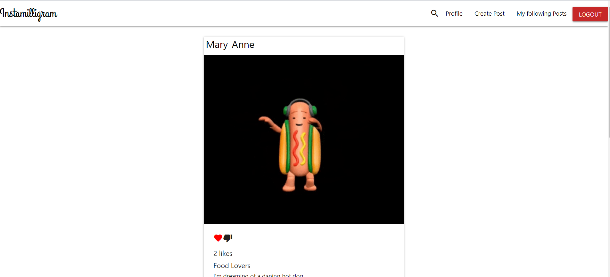

# social-media-MERN-stack

### MERN Stack Aplication

### About app

- Social media MERN-Stack is an instagram-like app that functions from frontend to backend which allows users to signup a new account, log in, update profile, upload profile picture, create a post with image upload, search for users, follow other users, like, unlike, add and update comments.

### Technolgies

- React

- Heroku (for deployment)

-  Node

- Materialize

- Font Awesome

- Express

- MongoDB

### Dependencies

- react-router-dom / bcryptjs / jsonwebtoken / nodemailer / nodemailer-sendgrid-transport

